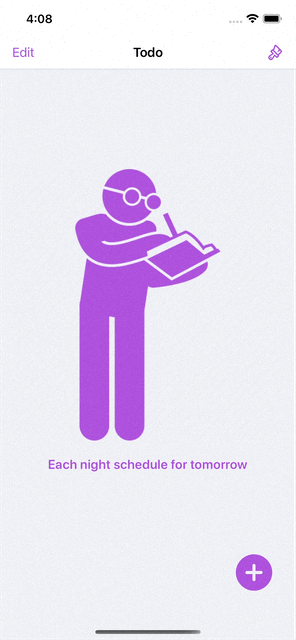
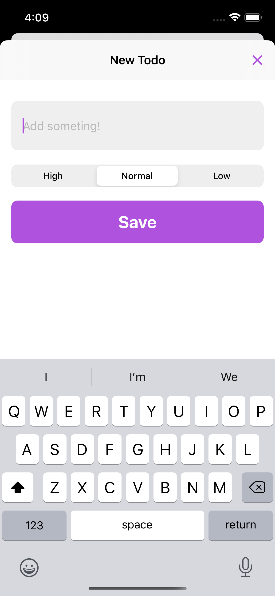
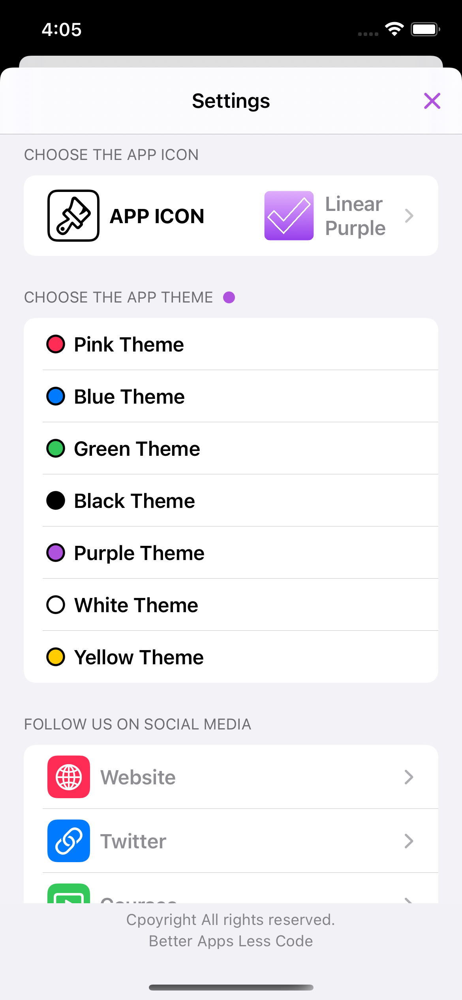

# To-Do App
SwiftUI, a to-do app follow the courses by [Credo Academy](https://www.youtube.com/channel/UCwj8wWneM1JkNuM_HoJzb-g), with extra feature added myself like first responder textfield.

# Menu
* [Screenshots](#screenshots)
* [Features](#features)
* [Source](#source)
* [Contributions](#contributions)
* [Contact](#contact)

# Screenshots

 

# Features

* Fully programmatically UI (SwiftUI)
* Random Empty View
* Animated add button
* Be able to choose alternate icons
* First responder textfield with UIRepresentable
* Ability to change app's overall theme
* Works on ipad

### Known Issues
- First icon won't work
- Had to relaunch the app for theme chaging

# Source
This to-do app follow the courses by [Credo Academy](https://www.youtube.com/channel/UCwj8wWneM1JkNuM_HoJzb-g), fully developed with Swift.

# Contributions

* All kinds of contributions (enhancements, new features, documentation & code improvements, issues & bugs reporting & todo task) are welcome. Let's make it better.

# Contact
Created by [Terry Kuo](https://twitter.com/ArgonYoYo) - feel free to contact me!
